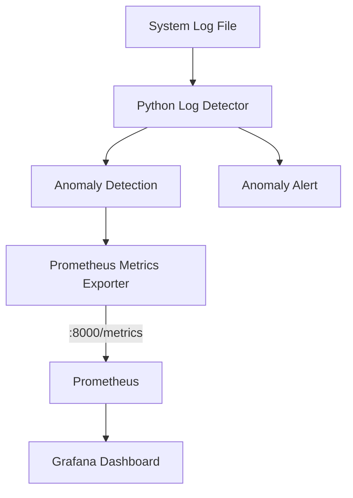

# 🤖 Advance Log Detector

A Python-based AIOps project that analyzes system logs, detects unusual log events, exposes monitoring metrics with Prometheus, and visualizes the data through Grafana.

The project is containerized using Docker Compose so the complete monitoring stack can be started with a single command.

---

## 📌 Overview

In a production environment, applications and servers generate a large number of log entries. Manually checking these logs for unusual events can be difficult and time-consuming.

This project provides a simple automated approach:

* Reads system log data
* Processes log entries using Python
* Detects anomalous log events
* Exposes application metrics through a Prometheus endpoint
* Collects metrics using Prometheus
* Provides Grafana for monitoring and visualization
* Runs all services using Docker Compose

The project was built as a practical AIOps/DevOps monitoring project.

---

## ✨ Features

* 🔎 Log anomaly detection using Python and Scikit-learn
* 📊 Custom Prometheus metrics
* 🐳 Dockerized application
* 🔗 Docker Compose multi-container setup
* 📈 Prometheus monitoring
* 📉 Grafana visualization
* ⚡ Real-time metric updates
* 🚨 Anomaly detection alerts from processed logs
* 🛠️ Simple local development and testing setup

---

## 🏗️ Architecture



### Data Flow

```text
System Logs
     │
     ▼
Python Log Detector
     │
     ▼
Anomaly Detection
     │
     ▼
Prometheus Metrics
     │
     ▼
Prometheus
     │
     ▼
Grafana
```

---

## 🧰 Tech Stack

| Technology        | Purpose                              |
| ----------------- | ------------------------------------ |
| Python 3.10       | Log processing and application logic |
| Pandas            | Log/data processing                  |
| Scikit-learn      | Anomaly detection                    |
| Prometheus Client | Exposing application metrics         |
| Prometheus        | Metrics collection and monitoring    |
| Grafana           | Metrics visualization                |
| Docker            | Application containerization         |
| Docker Compose    | Multi-container orchestration        |
| Ubuntu / Linux    | Development environment              |

---

## 📁 Project Structure

```text
Advance_Log_Detector/
│
├── detector.py
├── exporter.py
├── sample_system.log
│
├── Dockerfile
├── docker-compose.yml
├── prometheus.yml
├── requirements.txt
├── .dockerignore
├── .gitignore
└── README.md
```

### File Description

| File                 | Description                                      |
| -------------------- | ------------------------------------------------ |
| `detector.py`        | Contains the log anomaly detection logic         |
| `exporter.py`        | Runs the detector and exposes Prometheus metrics |
| `sample_system.log`  | Sample log data used for testing                 |
| `Dockerfile`         | Builds the Python application image              |
| `docker-compose.yml` | Runs the complete monitoring stack               |
| `prometheus.yml`     | Prometheus scrape configuration                  |
| `requirements.txt`   | Python dependencies                              |
| `.dockerignore`      | Files excluded from Docker build context         |
| `.gitignore`         | Files excluded from Git                          |

---

# 🚀 Setup

## Prerequisites

Make sure the following are installed:

* Docker
* Docker Compose
* Git
* Ubuntu/Linux or WSL

Check the installations:

```bash
docker --version
docker compose version
git --version
```

---

## 📥 Clone the Repository

```bash
git clone git@github.com:Danishwani1999/Advance_Log_Detector.git
cd Advance_Log_Detector
```

---

# 🐳 Run the Project

Build and start all services:

```bash
docker compose up -d --build
```

Check the running containers:

```bash
docker compose ps
```

Expected services:

```text
grafana_dashboard
log_anomaly_detector
prometheus_service
```

---

# 🌐 Service Endpoints

Once the containers are running:

| Service      |   Port | Purpose                        |
| ------------ | -----: | ------------------------------ |
| Log Detector | `8000` | Prometheus metrics endpoint    |
| Prometheus   | `9090` | Metrics collection and queries |
| Grafana      | `3000` | Monitoring dashboard           |

### Prometheus Metrics

```text
http://localhost:8000/metrics
```

### Prometheus

```text
http://localhost:9090
```

### Grafana

```text
http://localhost:3000
```

---

# 📊 Project Verification

The complete Docker Compose stack was tested successfully.

## 1. Docker Compose Status

```bash
docker compose ps
```

Output:

```text
NAME                    STATUS
grafana_dashboard       Up
log_anomaly_detector    Up
prometheus_service      Up
```

This confirms that the three main services are running.

---

## 2. Prometheus Health Check

Check whether Prometheus is healthy:

```bash
curl localhost:9090/-/healthy
```

Output:

```text
Prometheus Server is Healthy.
```

---

## 3. Prometheus Target

The log detector is configured as a Prometheus scrape target.

```text
job: log_detector_service
target: http://log-detector:8000/metrics
health: UP
lastError: ""
```

This confirms that Prometheus is successfully scraping the application metrics endpoint.

---

# 📈 Application Metrics

The application exposes custom metrics on port `8000`.

Check them with:

```bash
curl localhost:8000/metrics
```

Important metrics include:

### Logs Processed

```text
# HELP logs_processed_total Total count of log lines processed
# TYPE logs_processed_total counter
logs_processed_total 6.0
```

This counter tracks the number of log entries processed by the detector.

### Anomalies Detected

```text
# HELP log_anomalies_total Total count of detected anomalous log events
# TYPE log_anomalies_total counter
log_anomalies_total 2.0
```

This shows that **2 anomalous log events** were detected during the project test.

### Latest Anomaly Score

```text
# HELP latest_anomaly_score Statistical score of the most recently processed log entry
# TYPE latest_anomaly_score gauge
latest_anomaly_score -0.009159840678413356
```

This gauge stores the score associated with the most recently processed log entry.

---

# 🚨 Anomaly Detection Output

The detector was also tested directly through the running container.

Example output:

```text
Running log anomaly detection...
Prometheus metrics server is live on port 8000

[ALERT] Anomaly detected: System crash detected
```

This confirms that the application can process log entries and identify an anomalous event.

---

# 📊 Metrics Overview

| Metric                 | Type    | Purpose                                 |
| ---------------------- | ------- | --------------------------------------- |
| `logs_processed_total` | Counter | Total number of processed log entries   |
| `log_anomalies_total`  | Counter | Total number of detected anomalies      |
| `latest_anomaly_score` | Gauge   | Score of the latest processed log entry |

### Example Test Result

```text
Logs processed       : 6
Anomalies detected   : 2
Latest anomaly score : -0.009159840678413356
```

---

# 📈 Prometheus Monitoring

Prometheus collects metrics from:

```text
log-detector:8000/metrics
```

The configured Prometheus job is:

```yaml
scrape_configs:
  - job_name: 'log_detector_service'
    static_configs:
      - targets: ['log-detector:8000']
```

The application and Prometheus communicate through the Docker Compose network using the service name:

```text
log-detector
```

---

# 📊 Grafana

Grafana is included in the Docker Compose stack for monitoring and visualization.

Open:

```text
http://localhost:3000
```

Grafana can be connected to the Prometheus server using:

```text
http://prometheus:9090
```

Because both services run inside the same Docker Compose network, Grafana can communicate with Prometheus using the Docker service name.

---

# 🔄 Complete Monitoring Flow

```text
                 ┌──────────────────┐
                 │   System Logs    │
                 └────────┬─────────┘
                          │
                          ▼
                 ┌──────────────────┐
                 │  Python Detector │
                 └────────┬─────────┘
                          │
                          ▼
                 ┌──────────────────┐
                 │ Anomaly Detection│
                 └────────┬─────────┘
                          │
                          ▼
                 ┌──────────────────┐
                 │ Metrics Exporter │
                 │      :8000       │
                 └────────┬─────────┘
                          │
                          ▼
                 ┌──────────────────┐
                 │    Prometheus    │
                 │      :9090       │
                 └────────┬─────────┘
                          │
                          ▼
                 ┌──────────────────┐
                 │     Grafana      │
                 │      :3000       │
                 └──────────────────┘
```

---

# 🧪 Testing the Detector

To test the detector, add a new log entry to the sample log file.

Example:

```text
2026-10-02 15:01:00 ERROR Disk failure detected
```

The detector processes the log and updates the Prometheus metrics.

You can then check:

```bash
curl localhost:8000/metrics
```

and monitor the updated values through Prometheus and Grafana.

---

# 🔍 Useful Commands

### Start the stack

```bash
docker compose up -d
```

### Rebuild and start

```bash
docker compose up -d --build
```

### Check containers

```bash
docker compose ps
```

### View detector logs

```bash
docker compose logs -f log-detector
```

### View all service logs

```bash
docker compose logs -f
```

### Check Prometheus health

```bash
curl localhost:9090/-/healthy
```

### Check application metrics

```bash
curl localhost:8000/metrics
```

### Stop the stack

```bash
docker compose down
```

---

# 🛠️ Troubleshooting

## Port 9090 Already in Use

If Prometheus cannot start because port `9090` is already being used:

```bash
sudo lsof -i :9090
```

Stop the process using that port, then run:

```bash
docker compose up -d
```

---

## Check Container Logs

If a service is not working:

```bash
docker compose logs <service-name>
```

For example:

```bash
docker compose logs log-detector
```

---

## Check Prometheus Target

Open:

```text
http://localhost:9090/targets
```

The `log_detector_service` target should show:

```text
UP
```

---

# 🔐 Git Ignore

The project uses `.gitignore` and `.dockerignore` to prevent unnecessary files from being included in Git or Docker builds.

Local Python environments such as:

```text
venv/
__pycache__/
```

should not be committed to the repository.

---

# 🎯 What I Learned From This Project

This project helped me practice several practical DevOps and AIOps concepts:

* Building a Python monitoring application
* Working with Dockerfiles
* Creating a Docker Compose multi-container environment
* Container networking
* Exposing application metrics
* Prometheus scrape configuration
* Prometheus health and target verification
* Grafana monitoring
* Reading and processing system logs
* Basic anomaly detection
* Debugging containers and services
* Testing a monitoring stack from the terminal

---

# 🚀 Future Improvements

Some possible improvements for the project:

* Add more log formats
* Add configurable anomaly detection thresholds
* Create a dedicated Grafana dashboard
* Add Prometheus alerting rules
* Add Alertmanager integration
* Add persistent Prometheus storage
* Add CI/CD using GitHub Actions
* Deploy the stack to a cloud environment
* Add automated tests for the detector
* Add support for multiple log files

---

# ✅ Project Verification Checklist

```text
[x] Python log processing
[x] Anomaly detection
[x] Dockerfile
[x] Docker Compose deployment
[x] Prometheus metrics exporter
[x] Prometheus scrape configuration
[x] Prometheus health check
[x] Prometheus target verification
[x] Custom application metrics
[x] Anomaly detection test
[x] Grafana service
[x] End-to-end monitoring flow
```

---

## 👨‍💻 Author

**Danish Ahmad**

GitHub:
https://github.com/Danishwani1999

---

## ⭐ Project Summary

This project demonstrates a practical AIOps monitoring workflow where system logs are processed by a Python-based anomaly detector, application metrics are exposed through Prometheus, and the monitoring data can be visualized using Grafana.

It combines **Python, Machine Learning, Docker, Docker Compose, Prometheus, and Grafana** into one hands-on monitoring project.
