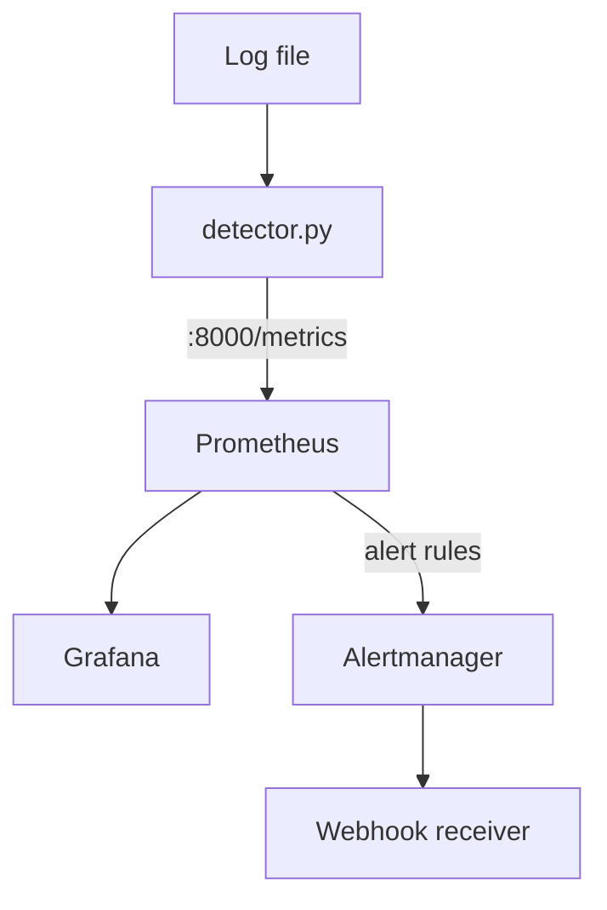
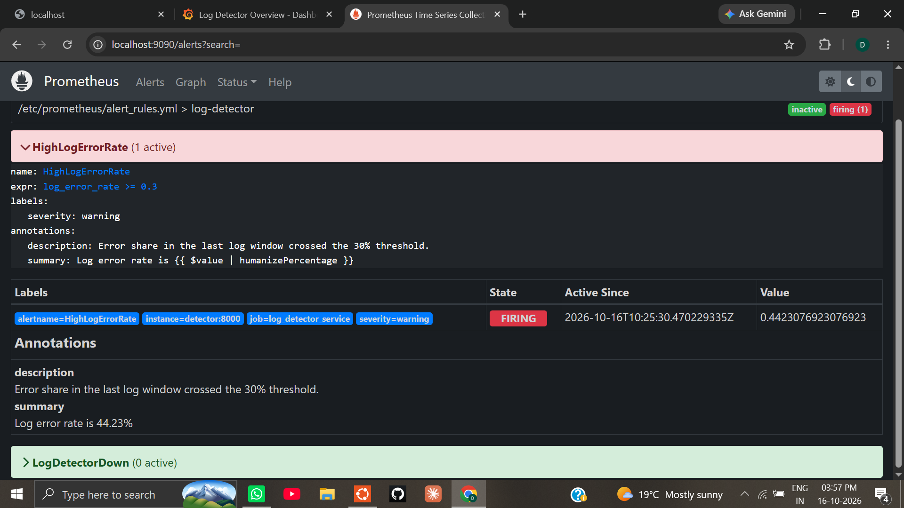
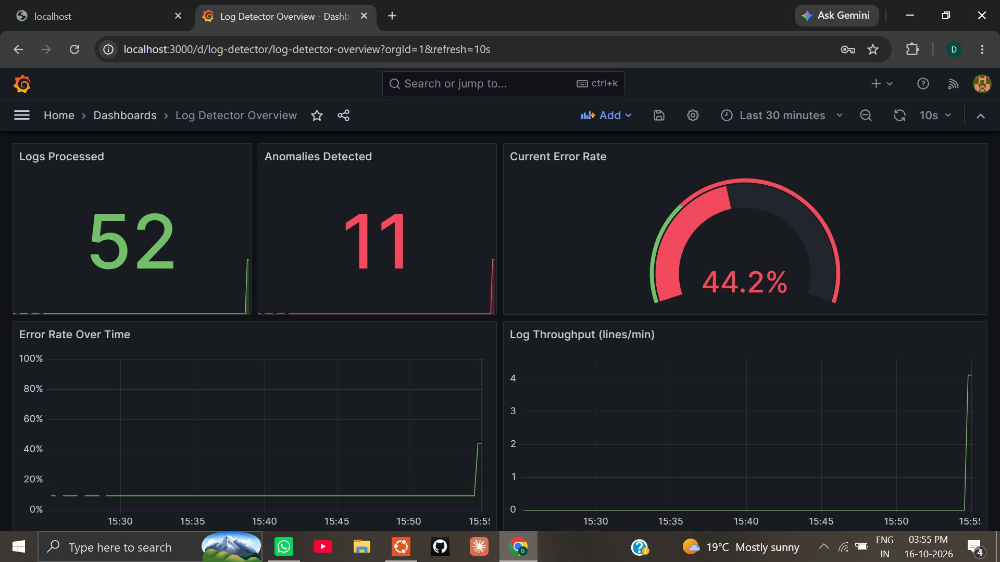
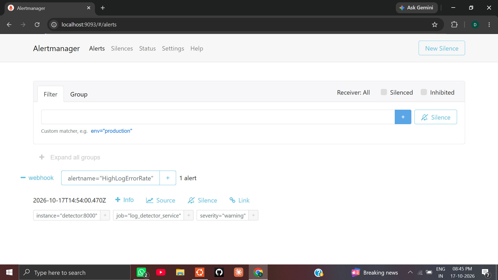
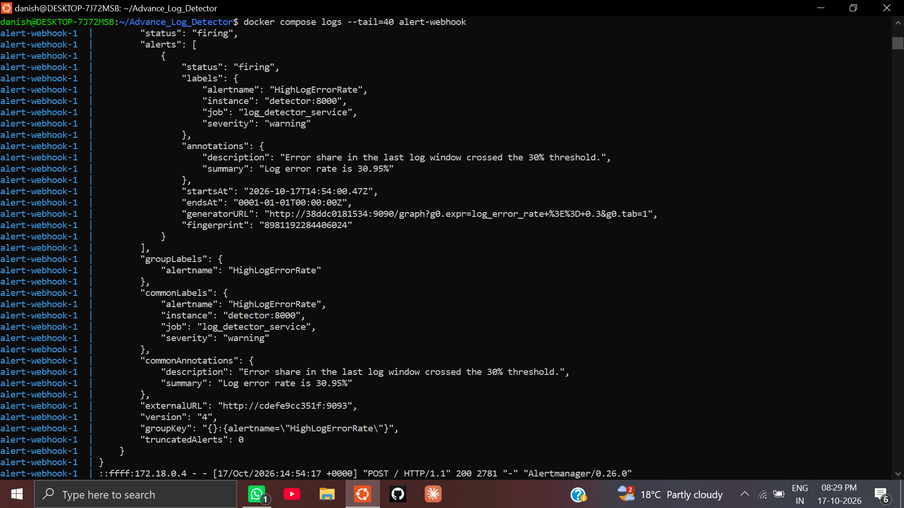

# Advance Log Detector

A small monitoring stack I built to learn how logs, metrics and alerts fit together. A Python service reads a log file, works out the share of error lines, flags a spike, and exposes it as Prometheus metrics. Prometheus fires alerts, Alertmanager routes them to a webhook, and Grafana draws it all on a dashboard. Everything runs with Docker Compose.

---

## Why I built this

I wanted to see the full alerting path work end to end: a log line goes bad, a metric moves, an alert fires, a message lands somewhere. The detection logic is deliberately simple; the goal was the DevOps plumbing around it.

---

## How it works

1. `detector.py` reads the log file and parses lines with regular expressions.
2. It tracks the share of error lines in the current window.
3. If the error rate goes above a threshold, it counts an anomaly.
4. It exposes metrics on `:8000/metrics` using `prometheus_client`.
5. Prometheus scrapes it and evaluates `alert_rules.yml`.
6. Firing alerts go to Alertmanager, which posts to a webhook receiver.
7. Grafana loads its datasource and dashboard from files.


```mermaid
flowchart TD
    A[Log file] --> B[detector.py]
    B -->|:8000/metrics| C[Prometheus]
    C --> D[Grafana]
    C -->|alert rules| E[Alertmanager]
    E --> F[Webhook receiver]
```

---

## Tech stack

| Tool | Role |
| --- | --- |
| Python 3.11, prometheus-client | Detection and metrics |
| Prometheus 2.47, Alertmanager 0.26 | Scraping, alert rules, routing |
| Grafana 10.1 | Dashboard provisioned from files |
| Docker Compose | Runs all five services |
| GitHub Actions, pytest, flake8 | CI, tests, lint |

---

## Getting started

```bash
git clone git@github.com:Danishwani1999/Advance_Log_Detector.git
cd Advance_Log_Detector
cp .env.example .env      # then set your own values
docker compose up -d --build
docker compose ps
```

| Service | Port |
| --- | --- |
| detector (metrics) | 8000 |
| Prometheus | 9090 |
| Alertmanager | 9093 |
| Grafana | 3000 |

| Variable | Default | Meaning |
| --- | --- | --- |
| `LOG_FILE_PATH` | `/data/sample_system.log` | Log file to read |
| `ERROR_THRESHOLD` | `0.3` | Error rate that counts as a spike |
| `READ_FROM_START` | `true` | Read from the beginning |

---

## What it looks like when it runs

Real output from my machine, captured right after `docker compose up`.

### Containers

```text
SERVICE         IMAGE                           STATUS
alert-webhook   mendhak/http-https-echo:31      Up 31 minutes
alertmanager    prom/alertmanager:v0.26.0       Up 31 minutes
detector        advance_log_detector-detector   Up 26 seconds (healthy)
grafana         grafana/grafana:10.1.0          Up 31 minutes
prometheus      prom/prometheus:v2.47.0         Up 31 minutes
```

### Detector metrics

```text
# HELP logs_processed_total Total raw log lines processed from system file
# TYPE logs_processed_total counter
logs_processed_total 42.0
# HELP anomalies_detected_total Total error-rate anomalies flagged by the detector
# TYPE anomalies_detected_total counter
anomalies_detected_total 1.0
# HELP log_error_rate Proportion of error logs in the last processing window (0.0 - 1.0)
# TYPE log_error_rate gauge
log_error_rate 0.30952380952380953
```

### Prometheus targets

```text
log_detector_service http://detector:8000/metrics up
```

### Alert rules loaded

```text
HighLogErrorRate - firing
LogDetectorDown - inactive
```

---

## Screenshots

### Grafana dashboard showing the detected anomaly



### Prometheus alert firing



### Alertmanager receiving the alert



### Webhook receiving the alert



---

## Try it yourself

```bash
for i in 1 2 3 4 5; do echo "2026-10-19 12:00:0$i ERROR Disk failure detected" >> data/sample_system.log; done
curl -s localhost:8000/metrics | grep -E "^(log_error_rate|anomalies_detected_total)"
docker compose logs -f alert-webhook
pip install -r requirements.txt && pytest && flake8
```

Then open `http://localhost:9090/alerts` to watch the alert fire.

---

## Things that went wrong (and the fixes)

* **Target DOWN.** Prometheus must scrape the Compose service name (`detector:8000`). My README and compose file once disagreed, so the output above is captured from the running stack.
* **Grafana empty.** Provisioning needed a single datasource and a proper dashboard provider.
* **Port in use.** `sudo lsof -i :9090`, then stop whatever holds it.

---

## What I learned

* Non-root containers with healthchecks
* How scrape jobs, alert rules and Alertmanager routes connect
* Provisioning Grafana as code
* Keeping secrets in `.env` and committing only `.env.example`
* Adding lint and tests to CI
* Keeping docs in sync with the code

---

## Next steps

* Multiple log files and formats
* A statistical detector instead of a fixed threshold
* Slack or email alerts
* Deploy to a cloud VM or Kubernetes

---

## Author

**Danish Ahmad Wani** · https://github.com/Danishwani1999

## License

MIT. See [LICENSE](LICENSE).
